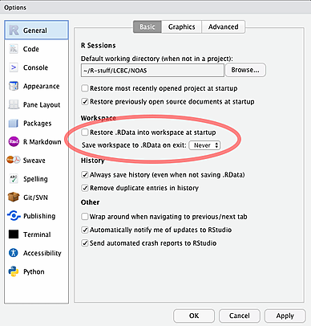

# How to protect sensitive data in R

R will automatically save your workspace when you work.
This means that any data you might have in your R environment while you work will be saved to a hidden file called `.RData` in your current working directory (or project directory). 
This file, while hidden, is easy for anyone to find and open.
If you have encrypted NOAS data you are working on, the decrypted data will be stored here, totally exposed.
*This must be avoided at all costs*. 

To disable saving your workspace in R, please follow the instructions below either for RStudio or R command line (depending on how you use R).

## Rstudio
RStudio by default will ask to save your workspace file every time you quite it. 
It will also incrementally automatically save your workspace, even without asking.
You have to turn this feature off, to work securely on NOAS data locally.
It is also recommended R best-practice to not have this option on.




To turn this off in RStudio, go to "Tools" -> "Global options" and in the "General tab", 
make sure that the dropdown menu for "Save workspace to .RData on exit" is set to "Never".
We also recommend having the "Restore .RData into workspace at startup" checked *off*. 

## R command line

When starting R from a terminal or command line, use the `--no-save` flag to avoid saving your workspace.

```sh
R --no-save
```

If you have started R from command line without the `--no-save` flag, and you exit R with the `q()` command, you will be asked if you want to save your workspace. Always type `n` for "no".

```r
> q()
Save workspace image? [y/n/c]: 
```
