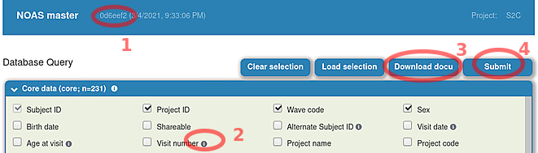
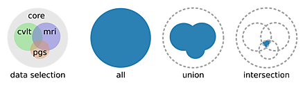
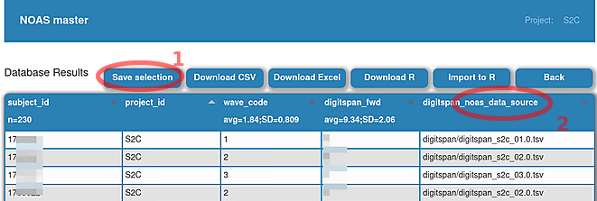
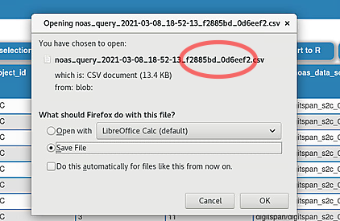

# Quick Start
(updated 17. March 2021)

NOAS gives you access to LCBCs inhouse data. As an alternative to the NOAS web UI you can work directly with its API or its raw .tsv files.

## 1) Select a project

First select a project. This will determine what data you will see on the next pages. 

### The "All" project

Select "All" if you want to see data for all projects combined. Some data is not "shareable", meaning we do not have permission to merge it across projects. This non-shareable data is excluded in "All". (Do not merge this data by hand unless you have permission for this.)

## 2) Select variables

On the next page you get an overview what data is available for the project you chose. Now you have to select the variables you are interested in. Press "Submit" _(4)_ once you are done.

It is highly recommended to not select more variables than you need for your analysis. If you plan multiple analysis with very different variables, rerun NOAS to get a separate set of data.

### About the data

  * Some variables have additional info which is available on the web-page _(2)_. In addition you can also download all current variable descriptions as a PDF _(3)_ (does not contain sensitive information).

  * Whenever you see "n=_some number_", it refers to the number of rows.

  * The NOAS data gets updated over time. _(1)_ shows you the ID of the current state.

### Query options

At the bottom of the page you will find "query options". There you can choose from three different set operations: 
  * **All** is a _full outer join_ between all tables.
  * **Union** is a _full outer join_ between the selected non-core tables (cvlt, mri, pgs, ...), the resulting table from which is then _inner joined_ with the core table.
  * **Intersection** is an _inner join_ between all selected tables.

## 3) Save your NOAS results

After you selected some variables, NOAS provides a preview of the data as well as different download options.

### You found an error in the data?

In NOAS, every data set "xy" has a variable "xy_noas_data_source" _(2)_. If you found an incorrect value, take a note of the columns "subject_id", "project_id", "wave_code" and "..._noas_data_source".

### Keep track of your data

  * When you download a table from NOAS, you may want to download the selection as well _(1)_. This file contains all info where your data was coming from. You can also use it to load a variable selection.

  * When you download data from NOAS, the default filename will contain two 7-digit hex-strings (for example `f288fbd_0d6eef2`). The first is the ID of your selection and the second is the ID of the NOAS data state. When you rename your files from NOAS, you may want to keep these two IDs.

